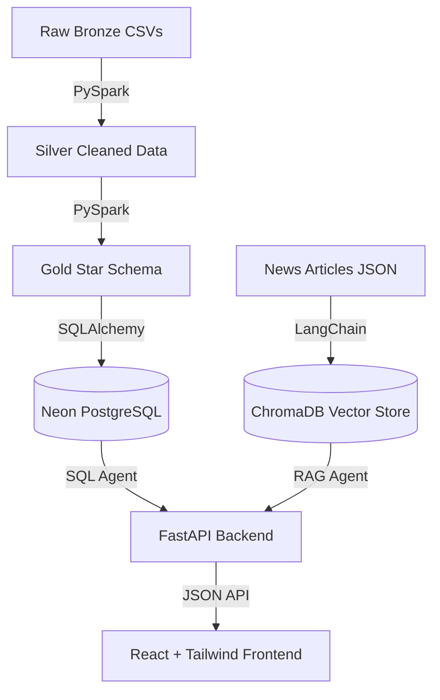

# Matrica: AI-Powered Esports Sponsorship Intelligence Platform 🏆

Matrica is an enterprise-grade esports analytics platform that uses a **Hybrid AI Architecture** to dynamically match global esports teams and brands with top-tier professional players. It fuses complex in-game performance metrics (structured data) with real-world news and brand sentiment (unstructured data).

Currently built for the **VALORANT Champions Tour (VCT) 2025**.

## 🚀 Key Features

* **Dynamic Data Pipeline (Medallion Architecture)**: Fully automated ETL pipeline that extracts raw VCT tournament data, cleans it using PySpark, models it into a Star Schema, and uploads it to a production PostgreSQL database.
* **Algorithmic Sponsor Matching**: Uses PostgreSQL math functions to dynamically calculate Player Popularity, Brand Reputation, and Estimated Budget across hundreds of professionals, matched perfectly against brand slider weights.
* **Hybrid AI Analysis**: 
  * **Structured**: FastAPI + PostgreSQL (`psycopg2`) handles real-time ranking algorithms.
  * **Unstructured**: LangChain + ChromaDB handles RAG (Retrieval-Augmented Generation) on real-world news articles.
  * **Generative**: Groq LLMs fuse the SQL rankings and ChromaDB context into a coherent, professional summary for sponsors.
* **Modern Web Interface**: Built with React, Vite, and Tailwind CSS.

## 🏗️ Architecture



## 🛠️ Tech Stack

* **Data Engineering**: Apache Spark (PySpark), Jupyter, `nbconvert`
* **Database**: Neon (Serverless PostgreSQL), ChromaDB (Vector Search)
* **Backend**: Python, FastAPI, SQLAlchemy, LangChain, Groq LLMs (Llama 3 / Mixtral)
* **Frontend**: React 18, TypeScript, Tailwind CSS, Vite, Axios

## 💻 How to Run the Project

### 1. Run the Data Pipeline (ETL Orchestrator)
The enterprise orchestrator will automatically execute all 6 data pipeline notebooks sequentially, clean the data, and push it to your PostgreSQL database.
```bash
# Activate your virtual environment
venv\Scripts\activate

# Run the Orchestrator
python data_pipeline/orchestrator.py
```

### 2. Start the Backend API
```bash
# In Terminal 1
venv\Scripts\activate
python backend/main.py
```
*API runs on `http://localhost:8000`*

### 3. Start the Frontend Web App
```bash
# In Terminal 2
cd frontend
npm run dev
```
*Website runs on `http://localhost:5173`*

---
*Built for the VCT 2025 Season. Data modeling and architecture designed for enterprise scalability.*
