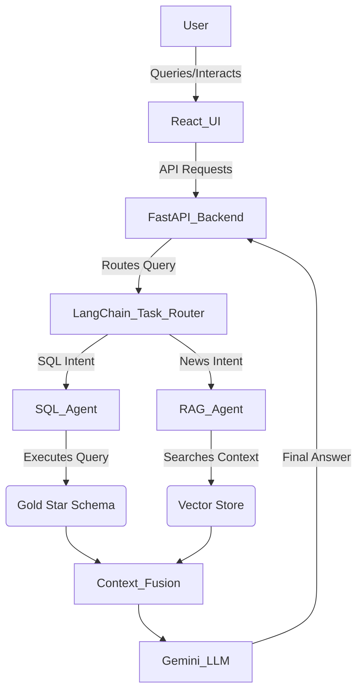
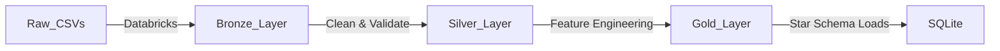

# Matrica Architecture

## Overall System Architecture

```mermaid
graph TD;
    User-->|Queries/Interacts| React_UI;
    React_UI-->|API Requests| FastAPI_Backend;
    FastAPI_Backend-->|Routes Query| LangChain_Task_Router;
    
    LangChain_Task_Router-->|SQL Intent| SQL_Agent;
    LangChain_Task_Router-->|News Intent| RAG_Agent;
    
    SQL_Agent-->|Executes Query| SQLite_DB(Gold Star Schema);
    RAG_Agent-->|Searches Context| ChromaDB(Vector Store);
    
    SQLite_DB-->Context_Fusion;
    ChromaDB-->Context_Fusion;
    Context_Fusion-->Gemini_LLM;
    Gemini_LLM-->|Final Answer| FastAPI_Backend;
```

## Data Engineering Pipeline (Medallion)

```mermaid
graph LR;
    Raw_CSVs-->|Databricks| Bronze_Layer;
    Bronze_Layer-->|Clean & Validate| Silver_Layer;
    Silver_Layer-->|Feature Engineering| Gold_Layer;
    Gold_Layer-->|Star Schema Loads| SQLite;
```
